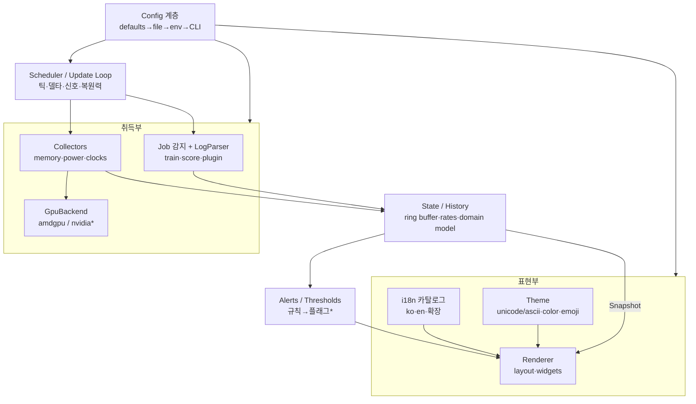

# strix-halo-monitor — 아키텍처 설계 문서

> 작성: 앜선생(System Architect) · 대상 독자: 개선생(구현) + 피샘/두목(리뷰)
> 상태: **설계안 (정본)**. 이 문서를 기준으로 개선생이 구현한다. 프로덕션 코드는 포함하지 않는다.

## 0. 배경과 설계 목표

현 `monitor.sh`는 단일 bash `while` 루프로, AMD Strix Halo(gfx1151, 통합메모리 APU)에서 도는
LLM 학습·채점 systemd `--user` 유닛을 감지해 GTT/VRAM/RAM/swap · 전력 3분할 · 클럭 · 잡 진행/ETA/모델정보를
2초 주기 clear-redraw로 보여준다. 동작은 검증됐으나 **단일 파일 210줄에 모든 관심사가 섞여** 있어
파서 확장·테스트·백엔드 추가가 어렵다.

**설계 목표**: 관심사를 분리해 유지보수·확장·테스트가 쉬운 유틸리티 프로그램으로 발전시킨다.
아래 하드 제약을 절대 위반하지 않는다.

| # | 제약 | 설계에 미치는 영향 |
|---|---|---|
| C1 | **극도로 경량** (학습 중 host RAM 0~4GB, 스왑 의존) | 무거운 런타임/프레임워크 금지. steady RSS를 bash판 수준으로 억제. 틱당 메모리 처닝·fork 최소화 |
| C2 | **read-only, 학습에 절대 간섭 없음** | sysfs/proc/로그는 읽기만. 도는 유닛을 건드리지 않음. write 경로 없음 |
| C3 | **터미널/SSH 친화, GUI 아님** | ANSI TUI. SSH 대역 배려(선택적 차분 렌더). 한글 폰트 없는 환경용 ASCII/영어 모드 유지 |
| C4 | **팀 Python 중심, 팀이 유지보수 주체** | 언어·의존성 선택의 **가장 강한 제약**. 팀이 못 고치는 스택은 탈락 |
| C5 | **이식성/결정성** — sysfs 의존은 불가피, HW/백엔드 추상화 여지 | GPU 백엔드 인터페이스로 amdgpu를 격리, 추후 nvidia 등 확장 |

---

## 1. 언어 선택

### 1.1 후보 트레이드오프

steady RSS는 근사치(정상 상태 상주 메모리)다. **핵심 관찰**: 현 bash판은 매 틱마다 `cat`·`awk`(다수)·`grep`(다수)·`seq`·`free`·`systemctl`·`rocm-smi`·`date`를 합쳐 **30개+ 프로세스를 fork/exec** 한다. fork는 스왑 압박 하에서 비싼 연산이고, `rocm-smi`는 그 자체가 무거운 Python 프로그램이다. 즉 "상주 4MB"라는 숫자는 실제 틱당 부하를 감춘다.

| 후보 | steady RSS(근사) | 틱당 부하 | 팀 유지보수(C4) | 배포 용이성 | TUI 성숙도 | 테스트 용이성 | 판정 |
|---|---|---|---|---|---|---|---|
| **bash 유지** | ~3MB 상주 | **틱당 30+ fork/exec** (숨은 부하 큼) | 중(팀이 bash는 다룸, 그러나 확장·테스트 난이도 높음) | 최상(파일 1개) | 낮음(직접 ANSI) | **낮음**(파서 유닛테스트 사실상 불가) | 확장·테스트 벽 → 탈락 |
| **Python(stdlib only)** | ~12–18MB | **fork 0**(상주 프로세스가 in-process 파싱), sysfs 직접 read | **최상**(팀 주력) | 상(`zipapp` 단일 `.pyz`, venv 불필요) | 중(직접 ANSI, 충분) | **최상**(순수 파서 함수 유닛테스트) | **권고** |
| Python + `rich` | ~30–45MB | 낮음 | 최상 | 상 | 상 | 최상 | C1 여유 있으면 선택 렌더러로 |
| Python + `textual` | ~45–70MB | 중(async 이벤트루프 상주) | 상 | 중(의존성 큼) | 최상 | 상 | **C1 위반 위험 → 탈락** |
| Go + Bubbletea | ~8–15MB | 낮음 | **하**(팀 비주력) | 최상(정적 단일 바이너리) | 상 | 상 | 기술적 우수하나 C4 위반 |
| Rust + ratatui | ~4–10MB | 낮음 | **최하**(팀 비주력, 러닝커브 큼) | 최상(단일 바이너리) | 상 | 상 | C4 위반 |

### 1.2 권고안: **Python 3, stdlib 우선(무거운 TUI 프레임워크 없이 직접 ANSI 렌더)**

근거:
1. **C4가 결정적 제약이다.** "팀이 유지보수 주체"이고 팀은 Python 주력이다. Go/Rust는 RSS만 보면 매력적이고 정적 바이너리 배포도 좋지만, 팀이 못 고치면 유틸리티로서 실패한다. 두목이 C4를 명시 제약으로 못박았으므로 여기서 결론난다.
2. **경량(C1)은 Python으로 충분히 달성 가능하며, 오히려 현 bash보다 스왑 박스에 친화적이다.** 상주 프로세스 하나가 sysfs를 직접 읽고 in-process 파싱하면 **틱당 fork가 0**이 된다. 현 bash의 틱당 30+ fork/exec 대비 스왑 스톰 유발 위험이 낮다. steady RSS 12–18MB는 60GB를 쓰는 학습 잡 옆에서 무시할 수준이고, 결정적으로 이 페이지들이 **자주 바뀌지 않으면**(버퍼 재사용) 스왑아웃돼도 웨이크당 스왑인 폭이 작다.
3. **테스트 용이성(과제 3)**: 로그 파서를 순수 함수로 두면 캡처한 실제 로그에 대해 유닛테스트가 바로 된다. bash로는 불가능한 영역이다.

### 1.3 Python 메모리 풋프린트 관리 방침 (C1 방어)

- **기본 경로에 무거운 프레임워크 금지**: `textual` 불채택. `rich`도 기본 비의존 — 필요 시 `--rich`로만 선택 로드(lazy import). 기본 렌더러는 stdlib ANSI로 구현한다. 2초 clear-redraw 모델에는 반응형 TUI 프레임워크가 불필요하다.
- **단일 프로세스·단일 스레드·블로킹 sleep**: async 이벤트루프 상주 비용 회피. 신호(SIGINT/SIGWINCH)만 처리.
- **틱당 할당 처닝 최소화**: 출력 문자열 버퍼 재사용, 히스토리는 **상한 있는 ring buffer**(`collections.deque(maxlen=N)`)로 무한 증가 차단. `gc` 임계 조정 고려.
- **서브프로세스 제거/감축**: sysfs·procfs를 파이썬으로 직접 read(현 bash의 `cat`/`awk`/`grep`/`free` 대체). `rocm-smi`는 그 자체가 무거우므로 **sysfs 클럭 경로(`.../hwmon*/freq*` 또는 `pp_dpm_sclk`)를 우선 시도**하고, 불가할 때만 저빈도(예: N틱마다 1회)로 `rocm-smi` fallback.
- **의존성 0 배포 옵션**: `zipapp`으로 단일 `.pyz` 빌드 → 박스에 `scp` 후 시스템 `python3`로 실행(venv·pip 불필요). 최소 구성 박스에서 Python 배포의 최대 약점을 제거.

> 정직한 대안 명시: **C4(팀 유지보수)가 구속 제약이 아니었다면 Go+Bubbletea가 기술적 최적**(정적 단일 바이너리, 낮은 RSS, 의존성 0 배포)이었다. 미래에 이 도구를 팀 밖으로 배포하거나 Python이 부담이 되면 재검토할 지점으로 남긴다. 아키텍처를 아래처럼 계층화해 두면 렌더러·수집기 인터페이스는 유지한 채 언어 이식도 상대적으로 수월하다.

---

## 2. 내부 파트/모듈 분할

### 2.1 계층 개요

중심에 **도메인 모델(dataclass)** 을 두고, 취득(수집기+파서) → 상태 → 렌더 방향으로 단방향 의존을 강제한다.
**`Snapshot` dataclass가 취득부와 표현부 사이의 유일한 계약(seam)** 이다. 렌더러는 수집기·파서를 절대 직접 알지 못한다.



의존 방향(위→아래로만 흐름):
```
config        (아무것도 의존 안 함)
  ▼
model         (config만; 순수 dataclass, 로직 없음 — 중심 계약)
  ▼
collectors, jobs   (model 생산; config 참조; backends 통해 HW 접근)
  ▼
state/history      (model 소비·축적)
  ▼
loop (scheduler)   (collectors+jobs 오케스트레이션 → state)
  ▼
alerts             (state 소비 → 규칙 평가)   [신규·선택]
  ▼
ui/renderer        (model+i18n+theme만 의존; 취득부를 절대 모름)
```

### 2.2 파트별 책임·인터페이스·의존

#### (A) UI/렌더 파트 — `ui/`
- **책임**: `Snapshot` 하나를 받아 한 화면 문자열을 만든다. 레이아웃 조립, 위젯(막대·전력 3분할·섹션·경고 플래그), i18n 문자열 치환, 테마(unicode↔ascii, color on/off, emoji on/off), ANSI 출력 드라이버.
- **입력**: `Snapshot`(도메인 모델), `Config`(언어·테마).
- **출력**: 렌더된 문자열을 stdout에 기록. (테스트에선 반환 문자열을 골든파일과 비교)
- **의존**: `model`, `ui.i18n`, `ui.theme`만. **수집기·파서·시스템콜 의존 금지.**
- **확장점**: `widgets.py`에 위젯 함수 추가로 새 지표 표시. `theme.py`로 폰트 없는 환경 대응(`--ascii`, `--no-emoji`, `--no-color`). SSH 대역 절약용 차분 렌더는 출력 드라이버 교체로 후속 도입.

#### (B) 시스템 정보 취득 파트 — `collectors/` + `collectors/backends/`
- **책임**: HW/OS 지표 프로브. 플러그블 `Collector` 추상화 + 백엔드 추상화.
- **인터페이스 (프로토콜)**:
  - `Collector.available() -> bool` — 이 환경에서 수집 가능한가(예: RAPL 파일 읽기 권한, hwmon 존재).
  - `Collector.collect(ctx) -> <부분 dataclass>` — 실패해도 예외 대신 부분/None 채움(현 bash의 "우아한 빈값" 철학 유지).
  - `GpuBackend` 프로토콜: `mem_info() -> MemoryStats`, `power() -> RawPower`, `clocks() -> ClockStats`, `detect() -> bool`. **amdgpu 구현이 sysfs 경로를 캡슐화**, nvidia는 인터페이스만(추후).
- **구성**: `MemoryCollector`(GTT/VRAM sysfs + free RAM/swap), `PowerCollector`(RAPL energy 카운터 + amdgpu hwmon `power1_input`), `ClockCollector`(sysfs 우선, `rocm-smi` 저빈도 fallback).
- **입력**: `Config`(sysfs 루트·권한 경로), 이전 표본(에너지 델타용은 loop가 관리).
- **출력**: 부분 도메인 dataclass(`MemoryStats`, `RawPower`, `ClockStats`).
- **의존**: `model`, `config`, `backends`. 위쪽(state/ui)을 모름.
- **테스트 용이성**: 수집기는 **주입 가능한 루트 경로**(기본 `/`)에서 읽는다. 테스트는 `tests/fixtures/sysfs/`의 가짜 트리를 가리켜 결정적으로 검증. RAPL 랩어라운드·권한 없음·파일 부재 케이스를 픽스처로 재현.

#### (C) 잡/로그 파싱 파트 — `jobs/`
- **책임**: systemd `--user` 유닛 감지, 잡 타입 판별, 로그에서 phase·진행·loss·s/step·ETA·모델정보 추출.
- **인터페이스 (프로토콜)**:
  - `detect.find_active_unit(glob) -> UnitRef | None` — 실행 중 유닛 우선, 없으면 최신 로그(현 로직 이관).
  - `JobParser` 프로토콜: `matches(unit: UnitRef) -> bool` (예: 이름에 `score` 포함), `parse(log_text, unit, now) -> JobState`. **파서 레지스트리**에 등록, 매칭되는 첫 파서 사용.
  - `modelinfo.parse_command(cmdline: str) -> ModelInfo` — `--base/--hqq-nbits/--seq/--max-new/--lora-r/--adapter/--heldout/--epochs` 파싱. 라벨 매핑(`base_label_for`)은 **데이터(dict/설정 파일)** 로 외부화해 코드 수정 없이 확장.
  - `eta.py` — 잡 타입별 ETA 추정 전략(학습: `(total-cur)*sstep`, 채점: 선형 외삽 등).
- **구성**: `TrainParser`, `ScoreParser` (+ 신규 잡타입은 파일 하나 추가 후 레지스트리 등록).
- **입력**: 로그 텍스트(tail), `UnitRef`, 현재시각.
- **출력**: `JobState`(phase 문자열 키 + 파라미터, progress, eta, model_info, error_count). **i18n 문자열을 여기서 만들지 않는다** — phase는 열거형/키로 반환하고 렌더러가 번역한다(현 bash는 파서에서 `t()`로 번역해 UI/로직이 얽혀 있음 → 이번에 분리).
- **의존**: `model`, `config`. 취득부·표현부와 독립.
- **테스트 용이성**: **최고 가치 영역.** 파서는 순수 함수(로그 문자열→`JobState`). 실제 로그 스니펫을 `tests/fixtures/logs/`에 커밋하고 phase 전이(양자화→첫스텝→학습→평가·저장→종료, 채점 준비→생성 N/M→종료)를 유닛테스트로 고정.

#### (D) 데이터/로그/상태 파트 — `state/` + `model.py`
- **책임**: 도메인 모델 정의 + 시계열·rate 축적.
- **`model.py`**: `MemoryStats`, `PowerStats`, `ClockStats`, `ModelInfo`, `JobState`, 그리고 최상위 **`Snapshot`**(위 전부 + 타임스탬프 + 알림 플래그). 순수 dataclass, 로직 없음. **이것이 시스템의 중심 계약.**
- **`state/history.py`**: 상한 있는 ring buffer(`deque(maxlen=N)`)로 최근 표본 보관 → GTT 증가율(현 `rate`), 전력 스무딩, 추후 스파크라인. 무한 증가 없음(C1).
- **입력**: 수집기·파서 출력. **출력**: `Snapshot`, 파생 지표(rate).
- **의존**: 없음(모델) / 모델(history).

#### (E) 설정 계층 — `config.py` [파트 추가 제안]
- **책임**: 계층적 설정 병합: **defaults → 설정파일(TOML) → 환경변수(`HALO_*`) → CLI 인자** (뒤가 우선, 현 bash의 "인자>환경변수" 규칙 일반화).
- **출력**: 불변 `Config`(로그 디렉토리·유닛 glob·타이틀·풀 GB·heldout total·언어·테마·갱신주기·sysfs 루트·라벨맵).
- **의존**: 없음. 모두가 참조.
- **비고**: 현 env-only 인터페이스와 100% 하위호환 유지(`HALO_LOG_DIR` 등 그대로). TOML은 **부가**.

#### (F) 갱신 루프/스케줄러 — `loop.py` [파트 추가 제안]
- **책임**: 틱 엔진. 매 주기 수집기·파서 호출 → state 갱신 → 렌더러 호출. **델타 상태 관리**(rate, RAPL 에너지 카운터 델타·랩어라운드 스킵, prev_* 값). 신호 처리(SIGINT 정상종료, SIGWINCH 재레이아웃). **복원력**: 한 수집기/파서가 던져도 루프는 죽지 않고 해당 필드만 비운 채 진행(현 bash의 `2>/dev/null` 관용 대체).
- **의존**: collectors·jobs·state·ui를 **오케스트레이션**(조립은 `app.py`가 DI로 주입).
- **비고**: 여기가 유일하게 "시간"과 "가변 상태"를 다루는 곳 — 나머지는 최대한 순수하게 유지해 테스트 가능성 확보.

#### (G) 알림/임계 — `alerts.py` [파트 추가 제안, 후순위]
- **책임**: `Snapshot`에 규칙 적용 → 플래그 생성(host RAM < 임계 → 위험, OOM/Traceback 로그 감지, swap 급증). **지금은 시각 플래그만**(현 `ramflag`·`err` 일반화). 추후 데스크톱/웹훅 알림으로 확장 가능한 규칙 인터페이스만 정의.
- **의존**: `model`, `config`. 출력은 `Snapshot`의 플래그 필드로 렌더러에 전달.

### 2.3 데이터 계약 (핵심 seam 요약)

| 계약 | 생산자 | 소비자 | 형태 |
|---|---|---|---|
| **`Snapshot`** | loop(취합) | renderer, alerts | dataclass(메모리·전력·클럭·잡·모델·플래그·ts) |
| `MemoryStats`/`RawPower`/`ClockStats` | collectors | state/loop | 부분 dataclass |
| `JobState` (phase는 **키/enum**, 번역 아님) | jobs 파서 | renderer(번역) | dataclass |
| `ModelInfo` | jobs.modelinfo | renderer | dataclass |
| `Config` | config | 전부 | 불변 dataclass |
| `GpuBackend` / `Collector` / `JobParser` | 백엔드·플러그인 구현 | loop | Protocol(덕타이핑) |

---

## 3. 확장성

- **새 지표 추가**: `Collector` 하나 작성 + `Snapshot`/모델에 필드 + `widgets.py`에 표시 위젯. 세 곳 국소 수정, 다른 파트 무영향.
- **새 잡타입(train/score/eval/기타)**: `jobs/`에 파서 파일 추가 → 레지스트리 등록 → 픽스처+테스트 추가. UI·수집기 손대지 않음. phase 키는 i18n 카탈로그에 문자열만 추가.
- **새 백엔드(nvidia 등)**: `GpuBackend` 구현체 추가(`collectors/backends/nvidia.py`), `detect()`로 자동 선택. amdgpu sysfs 경로가 백엔드 뒤에 캡슐화돼 있어 나머지 코드 불변.
- **플러그인화**: 파서·수집기·백엔드는 모두 **레지스트리 + 프로토콜** 패턴. 엔트리포인트 방식(`importlib.metadata` entry points)까지 갈 필요는 현 규모에 과함 → **내부 레지스트리로 충분**(YAGNI). 진짜 서드파티 확장이 필요해지면 그때 entry points로 승격.
- **테스트 용이성**: 파서=순수 함수(로그→상태), 수집기=주입 루트에서 읽음, 렌더러=Snapshot→문자열(골든파일). 세 축 모두 HW 없이 CI에서 결정적으로 검증 가능. `pytest` + `tests/fixtures/`(실제 로그·sysfs 스냅샷 캡처, 민감정보 마스킹 후 커밋).
- **패키징/배포**: `pyproject.toml` + 콘솔 스크립트 `halo-monitor`. 개발자는 `pipx install`, 대상 박스는 `zipapp` 단일 `.pyz`(의존성 0, 시스템 python3로 실행). CI에서 `.pyz` 아티팩트 빌드.

---

## 4. 디렉토리 구조 + 마이그레이션 경로

### 4.1 제안 구조

```
strix-halo-monitor/
├── README.md
├── DESIGN.md                 # (이 문서)
├── LICENSE
├── pyproject.toml            # 패키징·엔트리포인트(halo-monitor)·pytest 설정
├── legacy/
│   └── monitor.sh            # 컷오버 전까지 정상 동작하는 현 도구를 이관 보관
├── src/
│   └── halo_monitor/
│       ├── __init__.py
│       ├── __main__.py       # python -m halo_monitor
│       ├── app.py            # DI 조립: config→collectors/jobs→loop→renderer
│       ├── config.py         # (E) 계층 설정
│       ├── model.py          # (D) 도메인 dataclass — 중심 계약
│       ├── loop.py           # (F) 스케줄러/델타/신호/복원력
│       ├── alerts.py         # (G) 임계 규칙 → 플래그 (후순위)
│       ├── collectors/       # (B)
│       │   ├── base.py       # Collector 프로토콜·레지스트리
│       │   ├── memory.py
│       │   ├── power.py
│       │   ├── clocks.py
│       │   └── backends/
│       │       ├── base.py   # GpuBackend 프로토콜
│       │       ├── amdgpu.py
│       │       └── nvidia.py # 미래 스텁(인터페이스만)
│       ├── jobs/             # (C)
│       │   ├── base.py       # JobParser 프로토콜·레지스트리
│       │   ├── detect.py     # systemd 유닛 감지
│       │   ├── train.py
│       │   ├── score.py
│       │   ├── modelinfo.py  # command 라인 파싱
│       │   └── eta.py        # 잡타입별 ETA 추정
│       ├── state/            # (D)
│       │   └── history.py    # ring buffer·rate
│       └── ui/               # (A)
│           ├── render.py     # 레이아웃 조립
│           ├── widgets.py    # 막대·전력3분할·섹션·플래그
│           ├── theme.py      # unicode/ascii·color·emoji
│           └── i18n.py       # 메시지 카탈로그(ko/en)
└── tests/
    ├── fixtures/
    │   ├── logs/             # 실제 학습·채점 로그 스니펫(마스킹)
    │   └── sysfs/            # 가짜 sysfs 트리 스냅샷
    ├── test_train_parser.py
    ├── test_score_parser.py
    ├── test_modelinfo.py
    ├── test_memory_collector.py
    ├── test_power_delta.py   # RAPL 델타·랩어라운드
    └── test_render_golden.py # Snapshot→문자열 골든파일(ko/en)
```

### 4.2 단계적 마이그레이션 (한 번에 재작성 금지 — 파서부터 안쪽으로)

전략: **위험 낮고 테스트 가치 높은 순수 로직(파서·모델)부터 이관**하고, `monitor.sh`는 파리티가 확인될 때까지 **일상 도구로 계속 사용**한다. 각 단계 끝에서 bash 출력과 Python 출력을 **나란히 돌려 수치·레이아웃 일치를 확인**한다.

- **Phase 0 — 레포 준비 (동작 변화 0)**: `pyproject.toml`·패키지 스켈레톤·`pytest`·CI(테스트 실행) 추가. `monitor.sh`를 `legacy/`로 이동(README의 실행 경로만 갱신). 기존 도구는 그대로 작동.
- **Phase 1 — 도메인 모델 + 파서 이관 (최우선)**: `model.py`와 `jobs/`(train/score/modelinfo/eta)를 Python으로 구현. **살아있는 박스에서 실제 로그를 read-only 캡처**해 `tests/fixtures/logs/`에 마스킹 커밋, phase 전이를 유닛테스트로 고정. bash와 대조해 파서 동치 확인. 이 단계 산출물은 아직 대시보드가 아니라 **검증된 파싱 엔진**.
- **Phase 2 — 수집기 + 루프**: `collectors/`(memory/power/clocks, amdgpu 백엔드)와 `loop.py`(rate·RAPL 델타·랩어라운드·신호). sysfs 픽스처로 테스트. 라이브 수치가 bash와 일치하는지 확인. `rocm-smi` 의존을 sysfs 클럭 우선으로 개선.
- **Phase 3 — 렌더러 + i18n + 테마 (파리티 목표)**: 현 레이아웃을 **문자 단위로 동일하게** 재현(ko/en). `python -m halo_monitor`로 실행 가능. 며칠간 bash와 병행 실행해 파리티와 RSS 풋프린트 실측 확인(C1 게이트).
- **Phase 4 — 컷오버**: Python을 기본으로. `legacy/monitor.sh`는 fallback으로 보존. README·패키징(pipx / `.pyz`) 갱신.
- **Phase 5 — 확장(구조가 생긴 뒤)**: nvidia 백엔드 스텁, 스파크라인 히스토리, 임계 알림(`alerts.py`), TOML 설정, 차분 렌더(SSH 대역). 각기 독립 PR.

각 Phase는 독립 PR·리뷰 가능하며, Phase 3 종료 전까지 `legacy/monitor.sh`가 항상 안전망이다.

---

## 5. 개선생에게 넘길 오픈 이슈 / 결정사항 (피샘·두목 리뷰 포인트)

| # | 이슈 | 앜선생 제안 | 결정 필요 |
|---|---|---|---|
| O1 | 렌더링: stdlib ANSI vs `rich` | 기본 stdlib, `rich`는 `--rich` 선택·lazy import. C1 방어 | `rich` 의존을 애초에 허용할지 |
| O2 | 설정파일 포맷 | `tomllib`(py3.11+ stdlib) 부가, env/CLI는 하위호환 유지 | 박스 Python 버전 확인 필요 |
| O3 | **대상 박스 Python 버전** | 3.11+ 권장(tomllib·최신 dataclass) | **박스 실제 버전 확인**(O2·O4 좌우) |
| O4 | 로그 포맷 결합도 | 현 파서는 한국어 로그 문구(`Linear 양자화` 등)에 강결합. 학습 스크립트가 **머신리더블 상태 라인(JSON 등)** 을 함께 emit하도록 계약화하면 파서가 견고해짐 | 학습 스크립트 소유자와 협의(크로스팀). 지금 강결합 유지 vs 로그 계약 신설 |
| O5 | 배포 방식 | 개발=pipx, 박스=`zipapp .pyz`(의존성 0) | 채택 확인 |
| O6 | 히스토리 저장 | in-memory ring buffer만(디스크 I/O가 스왑 박스에 부담). 디스크 로깅은 opt-in | 디스크 영속 필요 여부 |
| O7 | 백엔드 추상화 깊이 | 지금은 `GpuBackend` **인터페이스만** 정의 + amdgpu 구현, nvidia는 스텁(YAGNI) | nvidia를 지금 실제 구현할지 |
| O8 | RAPL 권한 UX | 현 `chmod`/udev 수동 그대로. 셋업 헬퍼 스크립트 추가는 선택 | 헬퍼 제공 여부 |
| O9 | 갱신 모델 | Phase 3는 파리티 위해 clear-redraw 유지. 차분 렌더(SSH 대역·플리커 개선)는 Phase 5 | 차분 렌더 우선순위 |
| O10 | 파서/렌더 i18n 분리 | phase를 **키/enum**으로 반환, 번역은 렌더러가. (현 bash는 파서에서 번역해 얽힘) | 이 분리 방침 확정 |
| O11 | 테스트 픽스처 캡처 | 살아있는 박스에서 실제 로그·sysfs를 **read-only** 캡처·마스킹 후 커밋 | 누가 캡처·마스킹 담당 |
| O12 | 알림 범위 | 지금은 시각 플래그만(C2 read-only 유지). 데스크톱/웹훅은 규칙 인터페이스만 열어두고 후속 | 실제 알림 채널 필요 여부 |
| O13 | 라벨 매핑 외부화 | `base_label_for` 하드코딩 → 설정/데이터(dict)로 이동 | 확정 |

> **C2 재확인**: 전 파트 어디에도 write 경로가 없다. systemd 유닛에 대한 조작(start/stop/kill) API를 만들지 않는다 — 오직 `list-units`/`show`/`is-active` 읽기만. 이 read-only 불변식을 코드리뷰 체크리스트에 넣는다.
